# Horia Delicoti - CV

This repo contains the source of my personal CV. A PDF [(LaTeX)][latex] auto-built from [JSON Resume][json_resume] data.

## Motive

Instead of writting my resume in Word, PDF, or LaTeX, it is easy to write it as structured JSON data. Then use scripts to convert it
automatically into PDF.

## About

The resume content is defined in [`resume.yml`](/resume.yml) following the [jsonresume.org][json_resume] standard, and validated against [`schema.json`](/schema.json) using [`validate.py`](/lib/validate.py).
A [`LaTeX document`](/tex/resume.tex) is then generate from [`template.jinja`](/template.jinja) using [`generate.py`](/lib/generate.py) and [`compiled`](/lib/compile.py) to PDF using [pdflatex][pdflatex]. The generated PDF is located at [`out/resume.pdf`](/out/).

## Getting Started

### Prerequisite

To build/run this project, you need [LaTeX][latex] and [Python3][python3] installed on your machine.

- **[MacTeX][mactex]** and **[Python3][python3_brew]** for MacOS

```sh
brew install --cask mactex
brew install python3
```

- [TeX Live][texlive] and **[Python3][python3]** for Linux

```sh
sudo apt update
sudo apt install texlive-full
sudo apt install python3 python3-venv python3-pip
```

### Usage - Local

Check the [`Makefile`](/Makefile) for all available commands. Or run `make all` inside the project directory to install all dependencies, [`validate`](/lib/validate.py) content, [`generate`](/lib/generate.py) the LaTeX file and [`compile`](/lib/compile.py) it to PDF.

1. Clone the repository
2. Update resume content in [`resume.yml`](/resume.yml)
3. Run `make all` to install dependencies, validate, generate and compile the resume to PDF.

<details>
  <summary>Commands</summary>

- `make help`     - Show help message
- `make all`      - Install dependencies, validate, generate and compile
- `make install`  - Install dependencies in a virtual environment
- `make validate` - Validate content
- `make generate` - Generate LaTeX file
- `make compile`  - Compile PDF from LaTeX file
- `make clean`    - Remove generated files

```mermaid
flowchart LR
    %% Direction: left-to-right
    %% Nodes
    A[📝 resume.yml<br/>schema.json] -->|validate.py| B[✅ Validation]
    B -->|generate.py + template.jinja| C[📃 LaTeX document<br/>resume.tex]
    C -->|compile.py + pdflatex| D[📄 out/resume.pdf]
```

</details>



### Customize

You can modify the resume by editing the [`resume.yml`](/resume.yml) file, following the [JSON Resume standard](https://jsonresume.org/).
You can also customize the LaTeX template located at [`template.jinja`](/template.jinja) to change the layout and design of the resume.
All the scripts are located in the [`/lib`](/lib) directory.
They are triggered by the [`Makefile`](Makefile).

## Contributing

No need to contribute or raise issues. Just fork the repo and make the changes you need for your own CV.

## Attributions

### Contributors


## Acknowledgements

Thanks to [Lissy93 CV](https://github.com/Lissy93/cv) for the inspiration and [dwmkerr makefile-help](https://github.com/dwmkerr/makefile-help) for the Makefile template.

## Resources

- [PyLaTeX](https://jeltef.github.io/PyLaTeX/current/)
- [RenderCV](https://github.com/rendercv/rendercv)
- [JSON](https://www.json.org/json-en.html)
- [PyYAML](https://pypi.org/project/PyYAML/)
- [Coloroma](https://github.com/tartley/colorama)

## License

This project is licensed under the [MIT][mit] License. See the [LICENSE](/LICENSE) file for details.

<!-- License + Copyright -->
<p  align="center">
  <i>© <a href="https://horia.delicoti.com">Horia Delicoti</a> 2025</i><br>
  <i>Licensed under <a href="https://www.tldrlegal.com/license/mit-license">MIT</a></i><br>
  <a href="https://github.com/horia-delicoti"></a><br>
  <sup>Happy exploring 🙂</sup>
</p>

[json_resume]: https://jsonresume.org/
[pdflatex]: https://pypi.org/project/pdflatex/
[latex]: https://www.latex-project.org/
[mactex]: https://formulae.brew.sh/cask/mactex
[texlive]: https://www.tug.org/texlive/
[mit]: https://opensource.org/licenses/MIT
[python3]: https://www.python.org/downloads/
[python3_brew]: https://docs.brew.sh/Homebrew-and-Python

<!-- Coffee -->
<!--
  ( (
   ) )
........
|      |]
\      /
 `----'
-->