[][workflow_compile]
[][workflow_validate]
[][workflow_tag]
[][mit]
[][latex]

# 🧑‍💻 Horia Delicoti - CV

This repo contains the source of my personal CV. A PDF [(LaTeX)][latex] auto-built from [JSON Resume][json_resume] data.

## 💡 Motive

Instead of writing my resume manually in Word, PDF, or LaTeX, I maintain it as a structured JSON data then use scripts to automatically generate a LaTeX and PDF version.
automatically into PDF.

## 🧠 About

The resume content is defined in [`resume.yml`](/resume.yml) following the [jsonresume.org][json_resume] standard, and validated
against [`schema.json`](/schema.json) using [`validate.py`](/lib/validate.py).
A [`LaTeX document`](/tex/resume.tex) is then generated from [`template.jinja`](/template.jinja) using [`generate.py`](/lib/generate.py)
and [`compiled`](/lib/compile.py) to PDF using [pdflatex][pdflatex]. The final PDF is automatically generated in [`out/resume.pdf`](/out/).
The entire process: from `YAML` → `LaTeX` → `PDF` is fully automated via the [`Taskfile`](/Taskfile.yml).

## 🚀 Getting Started

### ⚙️ Prerequisite

To build or run this project, you need **[Task][taskfile]** and **[Python3][python3]** installed on your machine.
[Latex][latex] will be installed by the [Taskfile](/Taskfile.yml) _(using [MacTeX][mactex] on macOS. [TeX Live][texlive] on Linux)_

- **macOS**

```sh
brew install go-task
brew install python3

```

- **Linux**

```sh
sudo apt update
sudo apt install python3 python3-venv python3-pip curl -y
sh -c "$(curl --location https://taskfile.dev/install.sh)" -- -d
```

### 🧪 Usage - Local

```sh
# Clone the repo
git clone https://github.com/horia-delicoti/cv.git && cd cv

# Modify resume data
vim resume.yml

# Check all available commands
task help

# Or simply run everything (install deps, validate, generate, compile).
task all -v OUTPUT_PDF=out/<your_name>_CV.pdf # Optionally specify the output PDF file name using `OUTPUT_PDF` variable
```

<details>
  <summary>Commands</summary>

- `task help`        - Show help message
- `task all`         - Install dependencies, validate, generate and compile
- `task venv`        - Create a Python virtual environment if it doesn't exist
- `task install`     - Install required Python dependencies
- `task install-tex` - Install TeX Live (Linux) or MacTeX (macOS)
- `task validate`    - Validate YAML content against the JSON schema
- `task generate`    - Generate LaTeX file from YAML and Jinja2 template
- `task compile`     - Compile PDF from LaTeX file

```mermaid
flowchart LR
    %% Direction: left-to-right
    %% Nodes
    A[📝 resume.yml<br/>schema.json] -->|validate.py| B[✅ Validation]
    B -->|generate.py + template.jinja| C[📃 LaTeX document<br/>resume.tex]
    C -->|compile.py + pdflatex| D[📄 out/resume.pdf]
```

</details>



### 🎨 Customize

You can modify the resume by editing the [`resume.yml`](/resume.yml) file, following the [JSON Resume standard](https://jsonresume.org/).
You can also customize the LaTeX template located at [`template.jinja`](/template.jinja) to change the layout and design of the resume.
All the scripts are located in the [`/lib`](/lib) directory.
They are triggered by the [`Taskfile`](/Taskfile.yml)

### 📸 Screenshot

<h3 align="center">PDF 📄</h3>
<p align="center">

## 🤝 Contributing

No need to contribute or raise issues. Just fork the repo and make the changes you need for your own CV.

## 🙌 Attributions

### Contributors


## 🫡 Acknowledgements

Thanks to [Lissy93 CV](https://github.com/Lissy93/cv) for the inspiration and [dwmkerr makefile-help](https://github.com/dwmkerr/makefile-help) for the Makefile template.

## 📚 Resources

- [PyLaTeX](https://jeltef.github.io/PyLaTeX/current/)
- [RenderCV](https://github.com/rendercv/rendercv)
- [JSON](https://www.json.org/json-en.html)
- [PyYAML](https://pypi.org/project/PyYAML/)
- [Coloroma](https://github.com/tartley/colorama)

## ⚖️ License

This project is licensed under the [MIT][mit] License. See the [LICENSE](/LICENSE) file for details.

<!-- License + Copyright -->
<p  align="center">
  <i>© <a href="https://horia.delicoti.com">Horia Delicoti</a> 2025</i><br>
  <i>Licensed under <a href="https://www.tldrlegal.com/license/mit-license">MIT</a></i><br>
  <a href="https://github.com/horia-delicoti"></a><br>
  <sup>Happy exploring 🙂</sup>
</p>

[json_resume]: https://jsonresume.org/
[pdflatex]: https://pypi.org/project/pdflatex/
[latex]: https://www.latex-project.org/
[mactex]: https://formulae.brew.sh/cask/mactex
[texlive]: https://www.tug.org/texlive/
[mit]: https://opensource.org/licenses/MIT
[python3]: https://www.python.org/downloads/
[taskfile]: https://taskfile.dev/docs/installation
[workflow_validate]: https://github.com/horia-delicoti/cv/actions/workflows/validate.yml
[workflow_compile]: https://github.com/horia-delicoti/cv/actions/workflows/compile.yml
[workflow_tag]: https://github.com/horia-delicoti/cv/actions/workflows/tag.yml

<!-- Coffee -->
<!--
  ( (
   ) )
........
|      |]
\      /
 `----'
-->